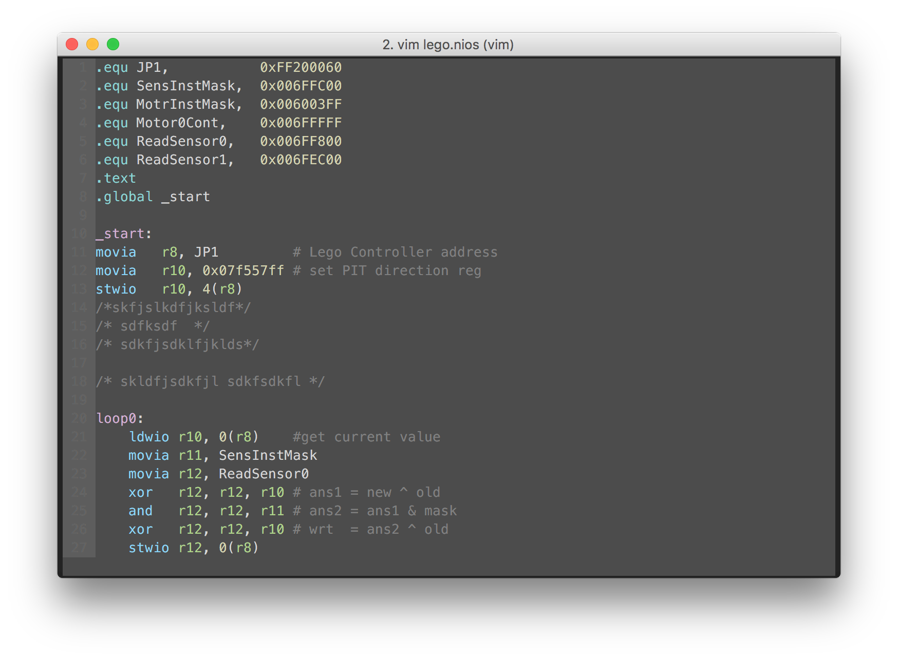

vim-nios
==============
NIOSII Syntax file.

Forked from https://github.com/Harenome/vim-mipssyntax




Installation
------------
### Regular installation
Just put the file ```nios.vim``` in your ```~/.vim/syntax``` folder.

### Vundle

add Plugin 'hfkang/vim-nios' to your .vimrc file and install


Highlights
----------
If you want to be able to tell the difference between actual instructions, aliases, macros and pseudo instructions, change the lines ```466``` to ```476``` to something like this, for instance:
````
hi def link niosComment             Comment
hi def link niosNumber              Number
hi def link niosString              String
hi def link niosLabel               Label
hi def link niosRegister            Identifier
hi def link niosDirective           Type
hi def link niosInstruction         Statement
hi def link niosAlias               PreProc
hi def link niosMacro               PreProc
hi def link niosPseudoInstruction   Special
hi def link niosPseudoDirective     Special
````
Of course, this requires your colorscheme to set different colours for these highlights.
